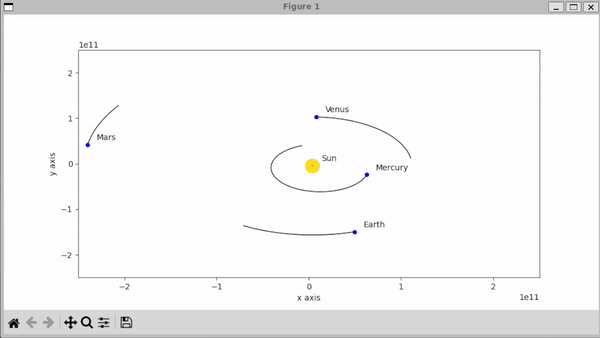

# Solar System Simulator
This is a one-to-one two-dimensional simulation of our solar system. I utilized gravitational N-body simulation for its implementaion. This simulation doesn't include moons and asteroids. In addition, it doesn't consider the rotation of planets or their Roche limit.

The initial conditions for the planets are obtained from NASA's [horizon systems](https://ssd-api.jpl.nasa.gov/doc/horizons.html) API.

The current simulation utilizes a leapfrog integration for numerically integrating gravitational differential.

## Installation

Use `pip` package manager to install the required packages:

```bash
python3 -m pip install -r requirements.txt
```
To run the software, execute the following commands in the project directory

```bash
cd src
python3 main.py
```

## The following celestial objects will be displayed
- Sun
- Mercury
- Venus
- Earth
- Mars
- Jupiter
- Saturn
- Uranus
- Neptune

## TODO
- Make the background black and add background stars
  
<p align="center">
 
